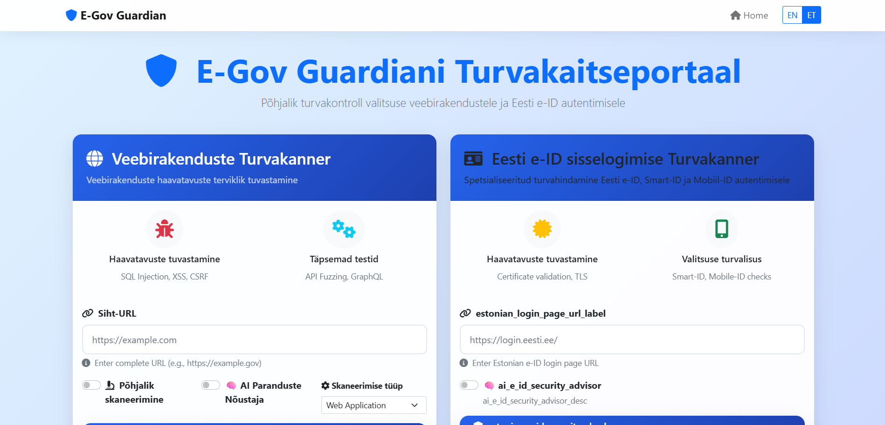

# E-Gov Guardian 🛡️

**AI-Powered Security Scanner for Web Apps + Estonian eID Integration**

A comprehensive security assessment platform designed specifically for Estonian digital infrastructure and government services. Built with deep expertise in Estonian e-ID authentication systems and powered by artificial intelligence, it helps developers secure their digital products and protect citizens' sensitive data.

## 🔗 Live Demo

**🌐 Live Site:** https://e-gov-guardian.onrender.com

**🛠️ Try scanning a URL or testing the Smart-ID login**

## 📋 Overview (What It Does)

E-Gov Guardian is a professional security scanner that combines traditional vulnerability detection with specialized Estonian e-ID authentication testing and AI-powered analysis.

**💡 Simple Workflow:**

```
Scan a web app → Detect SQL Injection/XSS/CSRF → Get AI-powered explanations + fix suggestions → Test Estonian e-ID security → Generate professional PDF reports
```

### Key Capabilities:

- **🔍 Web Application Security**: Comprehensive vulnerability scanning for government websites
- **🇪🇪 Estonian e-ID Integration**: Specialized testing for Smart-ID, Mobile-ID, and e-ID Card authentication
- **🧠 AI-Powered Analysis**: GPT-4o-mini provides contextual security recommendations
- **📊 Professional Reporting**: Executive summaries and detailed technical reports
- **🌍 Multi-Language Support**: Available in English and Estonian

## 🎯 Why I Built This

Estonia is a world leader in digital identity and public e-services, with over 99% of government services available online. As an Estonian developer, I recognized that:

- **Cybersecurity is critical** for maintaining trust in e-Governance
- **Traditional scanners miss** the nuanced security requirements of Estonian authentication systems
- **AI can bridge the gap** between technical findings and actionable recommendations
- **Citizen data protection** requires specialized tools for government-grade security

I wanted to create a tool that helps Estonian developers and government agencies secure their applications with the help of AI and deep knowledge of national ID systems.

## ✨ Features

| Feature                   | Description                                                                                       |
| ------------------------- | ------------------------------------------------------------------------------------------------- |
| 🔍 **Web Scanner**        | Scans apps for SQL injection, XSS, CSRF, security headers, CORS, and OWASP Top 10 vulnerabilities |
| 🧠 **AI Suggestions**     | GPT-4o-mini explains risks in plain language and suggests specific fixes                          |
| 🇪🇪 **eID Integration**    | Specialized testing for Smart-ID, Mobile-ID, and e-ID Card authentication flows                   |
| 📊 **Results Dashboard**  | Real-time scan progress, vulnerability breakdown, and compliance scoring                          |
| 📄 **PDF Reports**        | Professional reports suitable for audit evidence and stakeholder presentations                    |
| 🌍 **Multi-Language**     | Full Estonian and English language support                                                        |
| ⚡ **Real-time Scanning** | Live progress updates and concurrent scan support                                                 |
| 🔧 **Advanced Testing**   | API fuzzing, GraphQL security, subresource integrity, and more                                    |

## 🛠️ Tech Stack

### Backend

- **Python 3.11**: Core application runtime
- **Flask 3.1**: Web framework with Jinja2 templating
- **Gunicorn + gevent**: Production WSGI server for high concurrency
- **OWASP ZAP**: Professional security scanning (optional integration)
- **OpenAI API**: AI-powered security analysis with GPT-4o-mini

### Frontend

- **Bootstrap 5**: Modern, responsive UI with professional styling
- **JavaScript**: Real-time progress updates and interactive features
- **Multi-language Support**: English and Estonian interface

### Security Tools

- **requests**: HTTP security testing and vulnerability detection
- **BeautifulSoup**: HTML parsing and analysis
- **Selenium**: Browser automation for complex authentication flows
- **python-nmap**: Network security scanning and port analysis
- **cryptography**: TLS/SSL security assessment
- **yara-python**: Malware detection and pattern matching

### Reporting

- **WeasyPrint**: Professional PDF generation with charts
- **ReportLab**: Advanced report layouts and formatting
- **JSON API**: Programmatic access to scan results

## 📸 Screenshots

### Homepage


_Clean, professional interface with dual scanner options - Web application scanner and Estonian e-ID scanner_


_Configurable security test selection with comprehensive vulnerability detection options_


_Advanced testing options and Estonian e-ID specific security features_

### Scan in Progress

.png>)
_Real-time progress tracking with detailed phase information and live vulnerability detection updates_

.png>)
_Professional progress indicators showing comprehensive security assessment phases_

### Scan Results + AI Explanation

_Executive summary with risk ratings, compliance scores, and vulnerability breakdown by severity_

_AI-powered recommendations for each finding with authentication method-specific security analysis_

### Application Interface

_Complete application interface showing the professional security scanning dashboard_

## 📄 Sample PDF Report

E-Gov Guardian generates professional PDF reports suitable for audit evidence and stakeholder presentations. Here's a sample security report:

**[📋 View Sample Security Report](security_report_20250716_143200.pdf)**upda

### Report Features:

- **Executive Summary**: High-level security assessment with risk ratings
- **Detailed Vulnerability Analysis**: Comprehensive breakdown of all findings
- **AI-Powered Recommendations**: Contextual fix suggestions for each vulnerability
- **Compliance Scoring**: eIDAS and GDPR compliance assessment
- **Professional Formatting**: Branded reports suitable for government agencies
- **Multi-Language Support**: Available in English and Estonian

## 🚀 How to Run Locally

### Prerequisites

- Python 3.11+
- Docker (optional, for containerized deployment)
- OpenAI API key (optional, for AI analysis)

### Method 1: Docker (Recommended)

```bash
# Clone the repository
git clone https://github.com/uzaif-lab/E-Gov_Guardian.git
cd E-Gov_Guardian

# Build and run with Docker
docker build -t egov-guardian .
docker run -e OPENAI_API_KEY="your-api-key" -p 5000:5000 egov-guardian

# Access the application
open http://localhost:5000
```

### Method 2: Local Development

```bash
# Clone the repository
git clone https://github.com/uzaif-lab/E-Gov_Guardian.git
cd E-Gov_Guardian

# Create virtual environment
python -m venv venv
source venv/bin/activate  # On Windows: venv\Scripts\activate

# Install dependencies
pip install -r requirements.txt

# Set environment variables
export OPENAI_API_KEY="your-api-key"  # Optional

# Run development server
python web_app.py
```

### Method 3: Docker Compose

```bash
# Clone and configure
git clone https://github.com/uzaif-lab/E-Gov_Guardian.git
cd E-Gov_Guardian

# Edit docker-compose.yml to add your OpenAI API key
# Then run:
docker-compose up -d
```

### Environment Variables

| Variable          | Description                      | Required   |
| ----------------- | -------------------------------- | ---------- |
| `OPENAI_API_KEY`  | OpenAI API key for AI analysis   | Optional\* |
| `WEB_CONCURRENCY` | Number of worker processes       | Optional   |
| `PORT`            | Application port (default: 5000) | Optional   |

\*AI analysis will be disabled if no API key is provided

## 🔧 Configuration

Copy `config.template.yaml` to `config.yaml` for advanced settings:

```yaml
# AI Analysis Configuration
ai_analysis:
  enabled: true
  model: "gpt-4o-mini"
  max_tokens: 150
  temperature: 0.1

# Scanner Configuration
scanner:
  max_scan_time: 1800 # 30 minutes
  max_depth: 5
  deep_scan_depth: 8

# OWASP ZAP Integration (Optional)
zap:
  enabled: false
  host: "127.0.0.1"
  port: 8080
```

## 🔍 Security Test Coverage

### Web Application Security

- ✅ SQL Injection (Error-based, Boolean-based, Time-based)
- ✅ Cross-Site Scripting (Reflected, Stored, DOM-based)
- ✅ Cross-Site Request Forgery (CSRF)
- ✅ Security Headers Analysis (CSP, HSTS, X-Frame-Options, etc.)
- ✅ Cookie Security Assessment (Secure, HttpOnly, SameSite)
- ✅ CORS Misconfiguration Testing
- ✅ Open Redirect Vulnerabilities
- ✅ Host Header Injection
- ✅ Directory Traversal
- ✅ Command Injection

### API Security

- ✅ REST API Endpoint Fuzzing
- ✅ GraphQL Introspection and Security
- ✅ Subresource Integrity Verification
- ✅ HTTP Method Testing (GET, POST, PUT, DELETE, etc.)
- ✅ Information Disclosure Detection

### Estonian e-ID Specific

- ✅ Smart-ID Authentication Flow Security
- ✅ Mobile-ID Implementation Testing
- ✅ e-ID Certificate Chain Validation
- ✅ TLS/SSL Configuration for e-ID Services
- ✅ Authentication Redirect Security
- ✅ Privacy and Data Protection Compliance

### Infrastructure Security

- ✅ TLS/SSL Configuration Testing
- ✅ Certificate Validation
- ✅ Network Security Assessment
- ✅ Service Discovery and Fingerprinting

## 🇪🇪 Estonian e-ID Security Expertise

E-Gov Guardian includes specialized knowledge of Estonian digital identity systems:

### Authentication Methods Supported

- **Smart-ID**: Mobile app-based authentication
- **Mobile-ID**: SMS-based authentication
- **e-ID Card**: Physical card-based authentication

### Compliance Frameworks

- **eIDAS Regulation**: European digital identity standards
- **Estonian Trust Services**: National digital identity requirements
- **GDPR**: Privacy and data protection compliance

### Security Assessments

- Certificate chain validation for e-ID services
- Authentication flow security analysis
- Privacy risk assessment
- Cross-border interoperability security

## 📊 API Reference

### Start Security Scan

```http
POST /scan
Content-Type: application/x-www-form-urlencoded

target_url=https://example.com
&deep_scan=true
&ai_analysis=true
&test_sql_injection=true
&test_xss=true
```

### Get Scan Results

```http
GET /api/scan-results/{scan_id}
```

### Download PDF Report

```http
GET /download/{scan_id}
```

### Estonian e-ID Scan

```http
POST /estonian-scan
Content-Type: application/x-www-form-urlencoded

estonian_url=https://login.eesti.ee
&estonian_ai_analysis=true
```

## 🛣️ Future Roadmap

- [ ] **Real Smart-ID/Mobile-ID Integration**: Direct integration with SK ID Solutions API
- [ ] **Exportable PDF Security Reports**: Enhanced reporting with executive summaries
- [ ] **Support for Estonian Public Service Domains**: Pre-configured scanning for government domains
- [ ] **Multilingual UI**: Enhanced Estonian + English language support
- [ ] **Scheduled Scans**: Automated security monitoring with email alerts
- [ ] **Team Collaboration**: Multi-user support for government agencies
- [ ] **Compliance Templates**: Pre-built templates for eIDAS and GDPR compliance
- [ ] **Integration APIs**: RESTful APIs for CI/CD pipeline integration

## 🤝 Contributing to Estonia's Digital Security

I welcome contributions from Estonian developers, security researchers, and government technologists who are passionate about protecting Estonian citizens' data and improving our nation's digital infrastructure security. Together, we can ensure Estonia maintains its position as a global leader in secure digital governance.

### Development Setup

```bash
# Clone and setup development environment
git clone https://github.com/uzaif-lab/E-Gov_Guardian.git
cd E-Gov_Guardian

# Create virtual environment
python -m venv venv
source venv/bin/activate  # On Windows: venv\Scripts\activate

# Install dependencies
pip install -r requirements.txt

# Run tests
python -m pytest

# Start development server
python web_app.py
```

## 🚀 Deployment

### Production Deployment Checklist

- [ ] Configure `OPENAI_API_KEY` environment variable
- [ ] Set appropriate `WEB_CONCURRENCY` for your infrastructure
- [ ] Configure reverse proxy (nginx/Apache) with SSL termination
- [ ] Set up monitoring and logging
- [ ] Configure backup and disaster recovery
- [ ] Implement rate limiting and DDoS protection
- [ ] Review and customize security scan configurations

### Monitoring

Monitor these key metrics in production:

- Response time for security scans
- Memory usage during concurrent scans
- AI API usage and costs
- Scan completion rates
- Error rates and types

## 📞 Support for Estonian Developers

### Getting Help

- **GitHub Issues**: Report bugs, request features, and discuss improvements with fellow Estonian developers
- **Security Issues**: Contact maintainers privately for security vulnerabilities - protecting citizens' data is our top priority
- **Estonian e-ID Questions**: Specialized support for Estonian authentication systems (Smart-ID, Mobile-ID, e-ID Card)
- **Community Support**: Connect with other Estonian developers working on digital government security

### Learning Resources for Estonian Developers

- **Estonian e-ID Security Documentation**: Official security guidelines and best practices
- **OWASP Security Testing Guide**: International security standards adapted for Estonian context
- **eIDAS Regulation Compliance Guide**: European digital identity requirements
- **Estonian Government Web Security Best Practices**: National security standards
- **RIA (Riigi Infosüsteemi Amet) Security Guidelines**: Official Estonian government IT security requirements

## 📄 License

**MIT License** © 2024 Mohd Uzaif Khan

E-Gov Guardian is developed with the mission of improving digital government security in Estonia and protecting Estonian citizens' data. This project is dedicated to the public good and the advancement of secure digital governance in Estonia.

As a developers, i have a unique opportunity and responsibility to maintain development with security. Every line of code i write, every security measure i implement, and every vulnerability i prevent helps protect the personal data and digital rights of estonian citizens.

---

_"Securing digital government services for Estonian citizens - because their trust in digital society depends on it"_

**E-Gov Guardian** - Professional security assessment for Estonia's digital future.

---

## 👤 Author & Contact

**👤 Built by:** [Mohd Uzaif Khan]

**📧 Email:** [uzaifkhan7867@gmail.com]

**🇪🇪 For Estonian Developers**

This tool was created specifically for the Estonian developer community. Whether you're working on government portals, e-services, or any digital product that serves Estonian citizens, E-Gov Guardian helps you maintain the security standards that our digital society depends on.

**Thank you**
